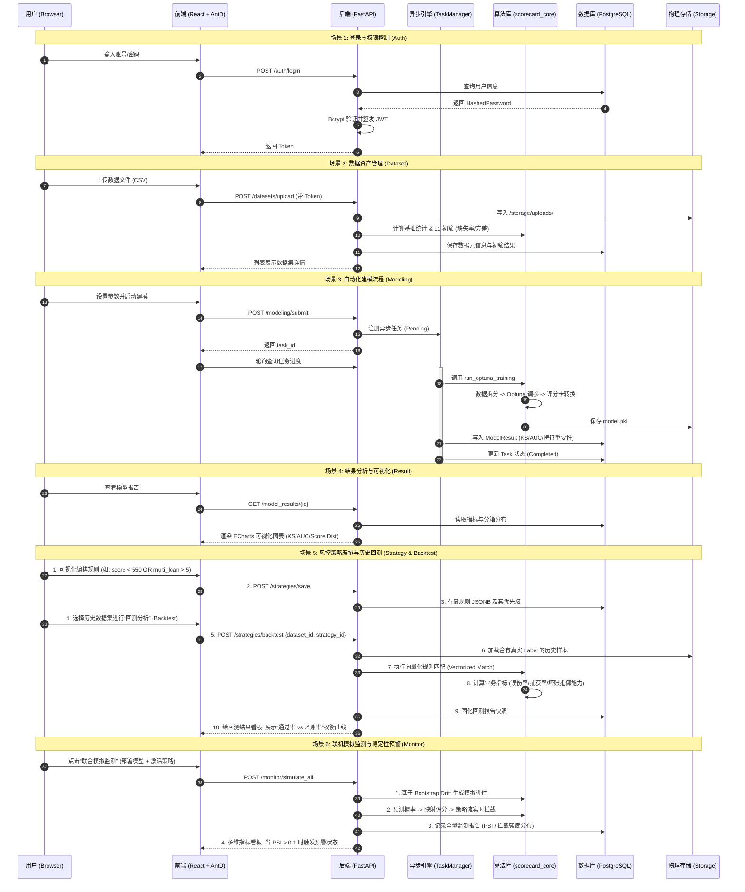

# AutoModeling Platform (自动化评分卡建模平台)

🚀 **AutoModeling Platform** 是一款面向风控场景的端到端自动化评分卡解决方案。它集成了数据上传、特征筛选、Optuna 模型调优、策略演习及线上监控等核心功能。

---

## 🛠️ 1. 开发环境集成指南

如果您是刚刚通过 Git Clone 检出项目，请务必执行以下步骤以初始化您的本地环境。

### A. 后端环境 (Backend Setup)
1. **运行环境**: Python 版本建议 **不低于 3.8**（推荐使用您本地的 `3.8` 环境）。
2. **进入目录**: `cd backend`
3. **安装依赖**: 
   *由于 Python 三方库已被 Git 忽略，必须执行依赖安装：*
   ```bash
   pip install -r requirements.txt
   ```
3. **数据库初始化**:
   - 检查根目录 `config.yaml` 的 `database` 配置。
   - 运行项目根目录下的 `init_scorecard.sql` 脚本，创建核心业务表。

### B. 前端环境 (Frontend Setup)
1. **进入目录**: `cd frontend`
2. **一键安装清单**:
   *这也是恢复被忽略包依赖的关键步骤：*
   ```bash
   npm install
   ```

---

## 🚀 2. 快速启动 (Running)

- **一键运行**: 
  在配置好 Python 环境后，您可以直接双击根目录下的 `start_project.bat` 脚本同时调起前、后端。
  
- **手动启动**:
  - **后端**: 在 `backend/` 目录下执行 `python app/main.py`（默认运行在 8081 端口）。
  - **前端**: 在 `frontend/` 目录下执行 `npm run dev`（Vite 调试模式，默认 5173 端口）。

---

## 📂 3. 核心目录结构
- `/backend`: 基于 FastAPI 的逻辑后端及核心算法。
- `/frontend`: 基于 React + Ant Design 的现代化 UI 界面。
- `/storage`: **[本地持久化目录]** 存放训练出的 `.pkl` 模型、`.csv` 原始数据集及生成的报告。
  - *注意：此目录内容受 .gitignore 保护，不参与版本管理。*

---

## 🏗️ 4. 系统交互流程图 (System Architecture)



祝您建模体验愉快！如果有任何问题，请随时在文档反馈。
