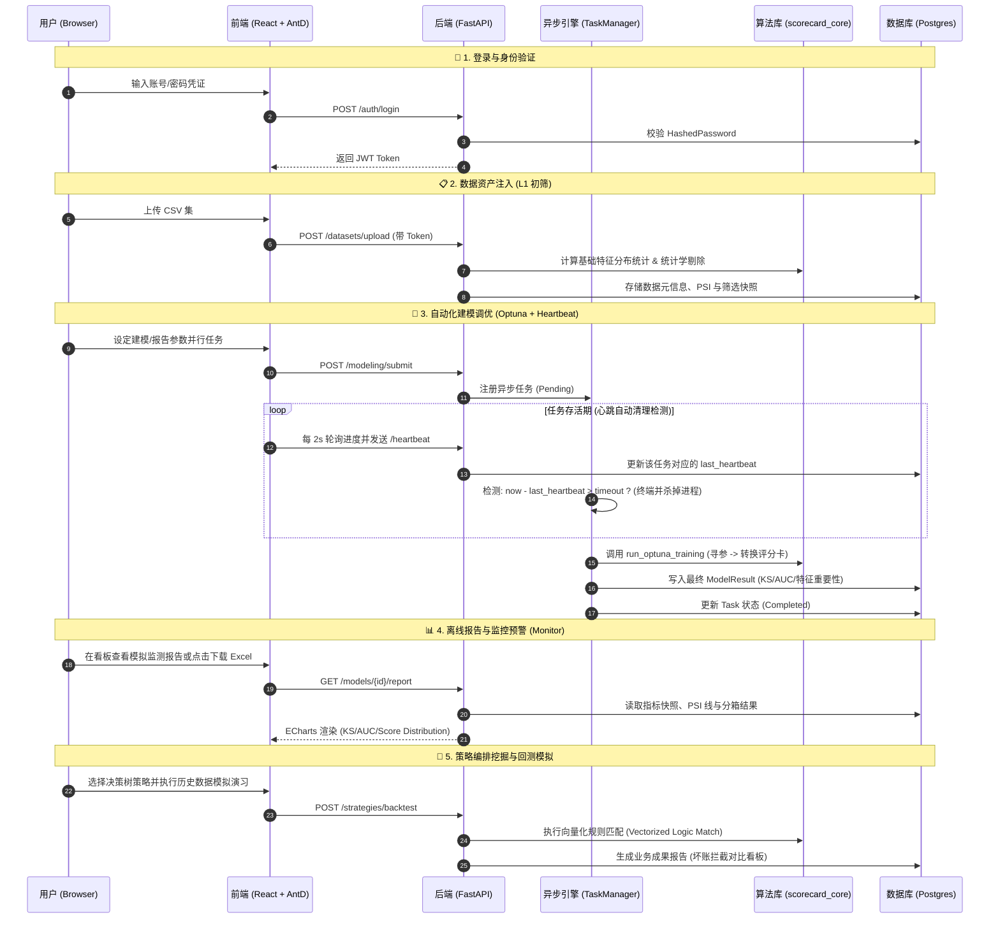

# AutoModeling Platform (自动化评分卡建模平台)

🚀 **AutoModeling Platform** 是一款面向风控金融场景的、端到端自动化评分卡建模与策略分析平台。它整合了传统评分卡理论与现代机器学习技术，旨在提供从原始数据清洗、变量筛选、Optuna 模型调优到策略回测与线上监测的全生命周期建模工具。

---

## ✨ 核心亮点 (Key Highlights)

-   **一致性评分引擎**：系统内置统一的 Proba-to-Score 映射模型，确保从训练、模拟到线上监测的各环境下，分值计算逻辑完全对齐，消除分值偏差风险。
-   **系统级资源安全**：内置**任务心跳自毁机制**。当浏览器刷新或断开连接时，后台高消耗任务（如寻参调优、报表生成）会在 60s 内自动终止并释放 CPU 资源，有效防止服务器空转。
-   **无头绘图优化**：采用 Matplotlib `Agg` 非交互式后端，支持在无桌面环境服务器中稳定输出 Excel 报表与可视化图表，极大提升了生产环境下的绘图可靠性。

---

## 🛠️ 环境准备与安装 (Setup)

### 1. 后端环境 (Backend Setup)
-   **Python 推荐**: Python 3.8 或更高版本（推荐使用 Conda 虚拟环境 `p_3_8_fb`）。
-   **安装依赖**:
    ```bash
    cd backend
    pip install -r requirements.txt
    ```
-   **初始化**: 根目录下的 `config.yaml` 存储核心配置（如数据库、心跳开关）。首次运行前请执行 `init_scorecard.sql` 初始化表结构。

### 2. 前端环境 (Frontend Setup)
-   **Node.js**: 建议使用 LTR 版本（16.x 或更高）。
-   **安装依赖**:
    ```bash
    cd frontend
    npm install
    ```

---

## 🚀 启动与运行 (Running)

-   **一键联测**: 双击点击根目录下的 `start_project.bat` 脚本（Windows 环境专用）。
-   **手动分块启动**:
    -   **API 后端**: `cd backend && python app/main.py` (默认端口 8081)。
    -   **UI 前端**: `cd frontend && npm run dev` (Vite 调试模式)。

---

## 📖 核心业务指南 (Case Flow)

1.  **数据资产上传**：上传 CSV 数据集。系统自动执行数据清洗与 **L1 基础分析**（去除缺失率/方差不足特征）。
2.  **多集变量分析**：灵活定义划分比例，对比训练集/验证集与测试集 (OOT) 的 IV、PSI 稳定性指标。
3.  **变量筛选 L2**：基于 IV、相关性、PSI 阈值执行自动变量剔除，锁定入模最佳特征池。
4.  **智能建模调优**：集成 **Optuna** 深度寻优算法，基于贝叶斯策略自动调参，并一键完成评分卡转换（支持 PDO/基准分调整）。
5.  **专业模型报告**：后台渲染 KS/AUC 曲线图与分箱分布图，支持导出内嵌特征分析详情的 Excel 企业级报告。
6.  **策略挖掘回测**：基于决策树自动挖掘拦截规则，通过历史样本回测评估“通过率 vs 坏账率”的平衡。
7.  **联机模拟监测**：基于 Bootstrap 生成模拟流量，动态监控指标漂移情况，实现线上稳定性实时预警。

---

## ⚙️ 全局配置项 (`config.yaml`)

| 配置模块 | 变量名 | 注解 |
| :--- | :--- | :--- |
| **database** | `password` | 数据库密码。为空时自动切换至本地 SQLite 文件驱动模式。 |
| **server** | `heartbeat_enabled` | **心跳开关**。控制关闭网页是否自动终断耗时后台任务。 |
| **server** | `heartbeat_timeout` | **超时阔值**。心跳续约最大时间（建议 60-120 秒）。 |
| **modeling** | `n_trials` | Optuna 进行参数寻优尝试的次数，值越大结果精度越高。 |

---

## 🏗️ 交互链路结构 (System Architecture)



---

祝您建模体验愉快！如果有任何建议，请联系系统管理员或查阅 `/backend/scorecard_core/` 实现。
